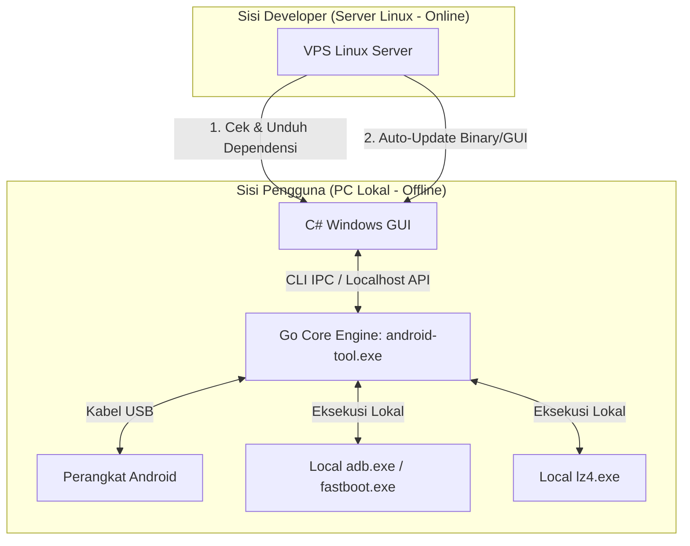

# Arsitektur Aplikasi & Rencana Pengembangan (Hybrid Online/Offline)

Dokumen ini berisi cetak biru (blueprint) arsitektur untuk pengembangan aplikasi Android Tool V2 yang menggabungkan kekuatan **Go (Core Engine)**, **C# (Windows GUI)**, dan **Linux VPS (Update & Dependency Server)**.

---

## 🏗️ 1. Gambaran Umum Arsitektur (High-Level Architecture)

Aplikasi dirancang dengan pola **Hybrid**:
- **Core Operations (Offline):** Seluruh fungsi penanganan device (ADB, Fastboot) dan ekstraksi file dilakukan secara lokal di PC pengguna menggunakan binary Go (`android-tool.exe`) yang dibungkus oleh antarmuka grafis C# (WinForms/WPF).
- **Control & Delivery (Online):** Proses instalasi driver, pengecekan kesiapan sistem (environment checker), dan pembaruan aplikasi otomatis (auto-updater) dipandu secara online melalui server Linux VPS terpusat.



---

## 🛠️ 2. Komponen Utama Sistem

### A. Go Core Engine (Backend Offline)
- **Tugas:** Menangani logika berat seperti parse CLI/API, dekompresi arsip (ZIP/TAR), integrasi tool eksternal (`adb`, `fastboot`, `lz4`), dan validasi file sistem.
- **Output Build:** `android-tool.exe` (Windows) / `android-tool` (Linux).
- **Mode Distribusi:** Dikemas di dalam folder instalasi lokal (tidak membutuhkan instalasi Go di PC pengguna).

### B. C# Windows GUI (Frontend Offline)
- **Tugas:** Menyediakan antarmuka ramah pengguna (UI modern, tombol, progress bar, popup) untuk menggantikan TUI (Terminal User Interface).
- **Teknologi:** Windows Presentation Foundation (WPF) / .NET MAUI / WinForms.
- **Interaksi dengan Go:** Memanggil `android-tool.exe` dengan melewatkan argumen CLI, atau melakukan panggilan REST API ke localhost yang dibuka oleh Go.

### C. Bootstrapper & Updater (Online Helper)
- **Tugas:** 
  1. **Env Checker:** Memastikan komputer pengguna sudah terpasang driver USB (Samsung/Xiaomi), `.NET Runtime`, serta tool pembantu (`adb.exe`, `lz4.exe`). Jika belum ada, program secara otomatis mengunduhnya dari server.
  2. **Auto-Updater:** Membandingkan checksum/versi lokal dengan versi di server VPS Linux saat aplikasi pertama kali dijalankan. Jika ada versi baru, otomatis melakukan pembaruan berkas.

---

## 🚀 3. Rencana Langkah Pengembangan (Roadmap)

### Fase 1: Pemantapan Go Core (Status: Berjalan)
- [x] Generalisasi Outer Extractor (.zip, .tgz, .tar, .tar.md5).
- [x] Implementasi Samsung Inner Extractor (ekstraksi komponen tar.md5 ke folder datar dengan dekompresi lz4 otomatis).
- [ ] Menambahkan dukungan REST API server minimalis pada Go menggunakan `net/http` (sebagai alternatif CLI IPC).

### Fase 2: Pembuatan Server Linux Update (Online VPS)
- [ ] Menyediakan VPS Linux dengan web server (Nginx/Apache) untuk meng-host:
  - Berkas update terbaru (`android-tool.exe`, C# assembly files).
  - Berkas dependensi universal (`adb.exe`, `fastboot.exe`, `lz4.exe`, driver usb).
  - Endpoint JSON sederhana untuk cek versi, contoh:
    ```json
    {
      "latest_version": "2.0.0",
      "required_dependencies": ["adb.exe", "lz4.exe"],
      "download_url": "https://server-anda.com/updates/v2.0.0.zip"
    }
    ```

### Fase 3: Pembuatan GUI C# & Bootstrapper (Windows)
- [ ] Membuat Installer/Bootstrapper C# yang melakukan unduhan dependensi otomatis saat pertama kali dibuka.
- [ ] Mendesain UI grafis utama C# (Tab ADB, Tab Fastboot, Tab Firmware Extractor).
- [ ] Menyambungkan tombol UI C# dengan eksekusi backend Go.

### Fase 4: Integrasi & Distribusi
- [ ] Pengujian penuh pada OS Windows (menggunakan driver lokal dan alat bantu yang diunduh otomatis).
- [ ] Rilis installer akhir (`AndroidToolSetup.exe`).
